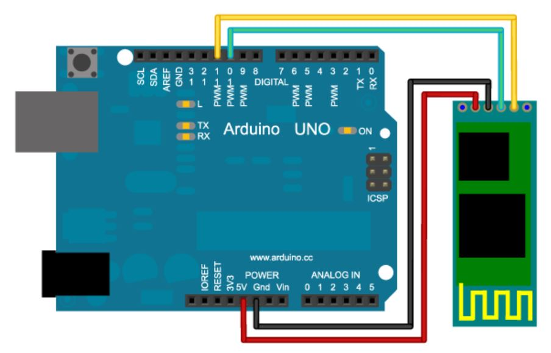
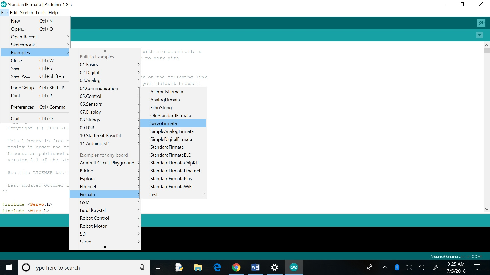
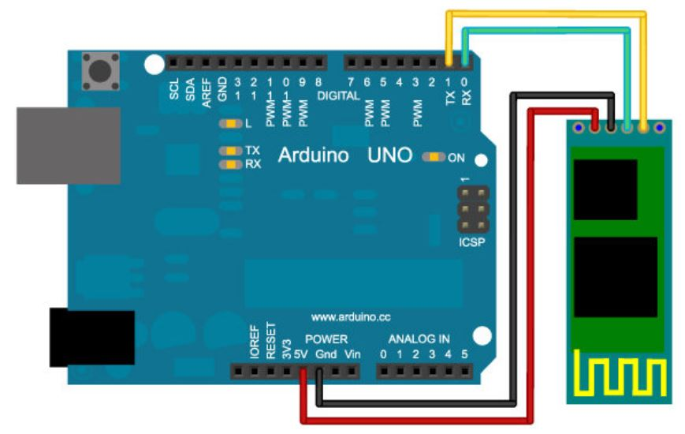
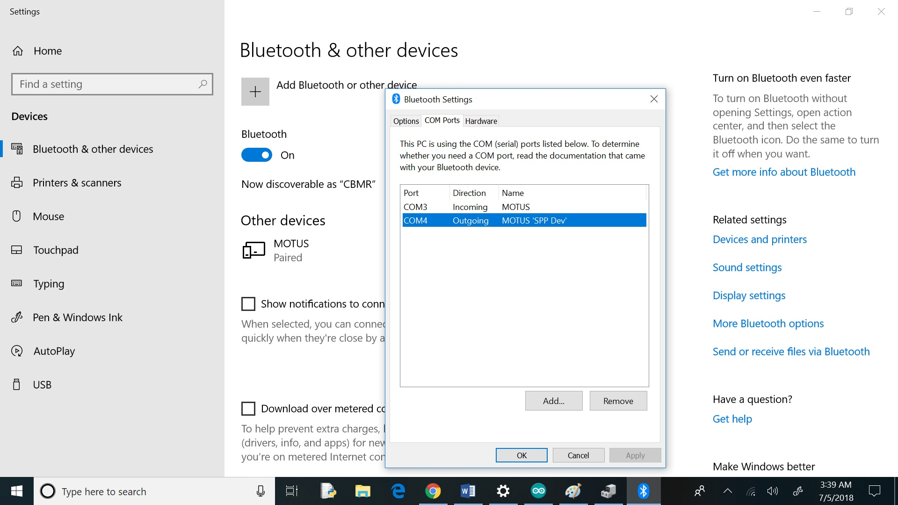
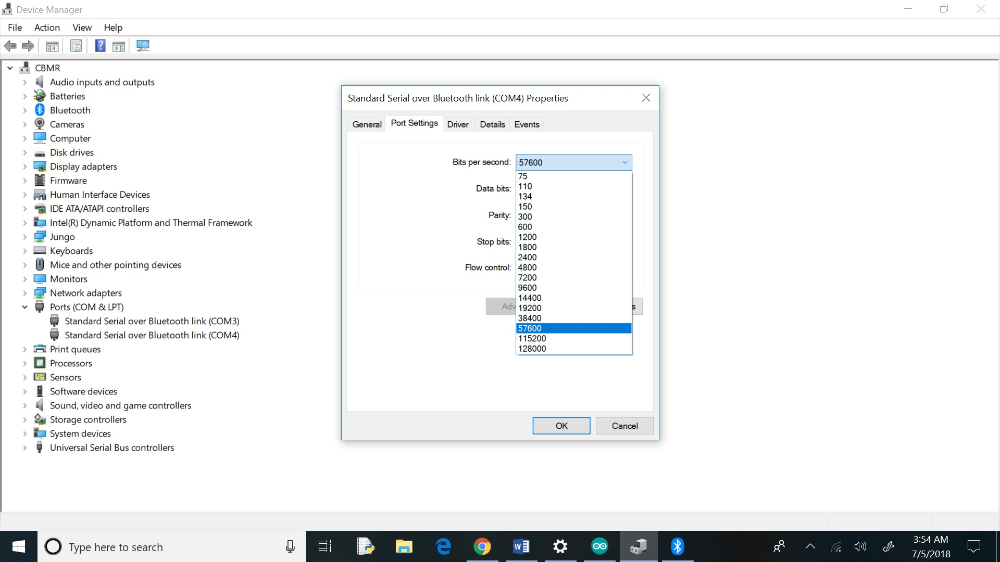
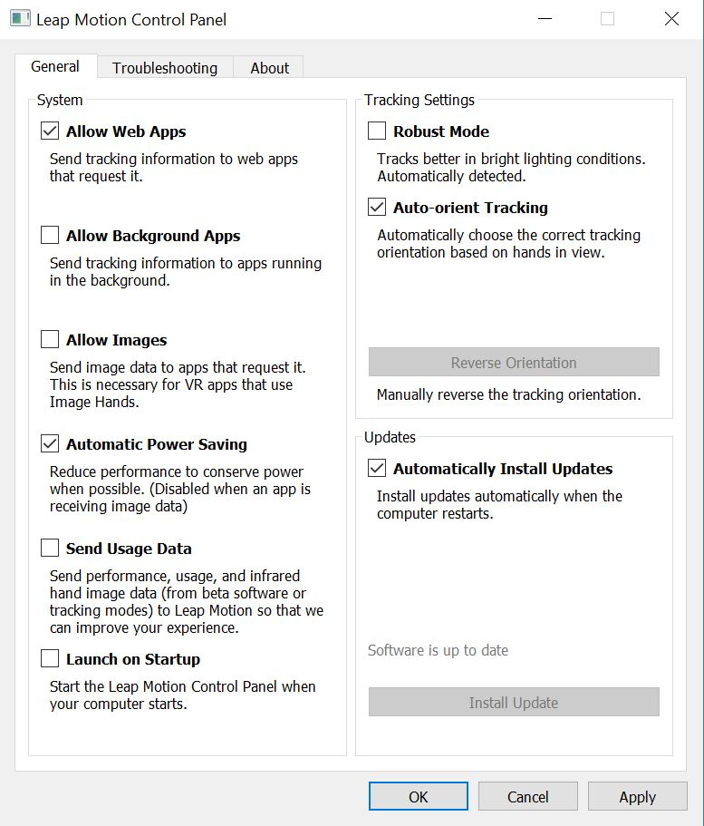
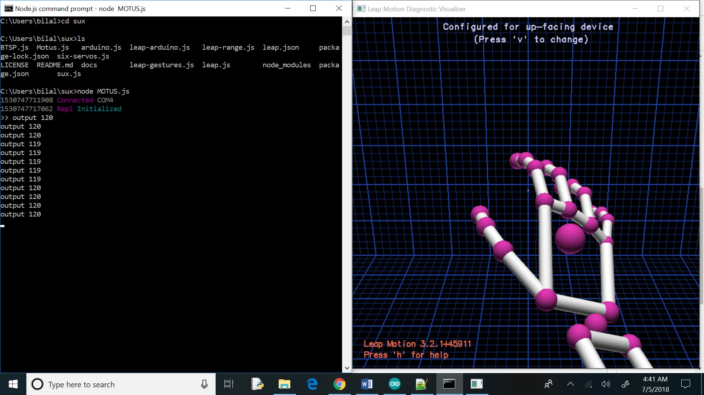

# MOTUS - Arduino Based Robotic Car Controlled Wirelessly Using Leap Motion Sensor

## Abstract

Motus is a robotic three wheeler vehicle with a turning mechanism controlled using Leap Motion Controller. The system can be consolidated into three components: Leap motion creates VR-Virtual Reality environment, circuit proceeds and transmits signals, and the DC motors and servo motors provides the feedback. All signals transmit through the bluetooth module HC-05 connected to Arduino UNO microcontroller along with the laptop’s bluetooth. This system involves the use of both software and hardware. A 12 volt DC lithium ion rechargeable battery pack is the only source of power. The Motus enhances the human interaction with hardware experience in the real world.

COMPONENTS:

1. RC Car Chasis
2. Leap Motion Controller
3. Microcontroller (Arduino UNO)
4. 2 x DC Brushless Motors
5. 2 x Small Size Wheels
6. Directional Wheel
7. Micro Servo Motor (SG90)
8. Bluetooth Module (HC-05)
9. 12 Volts Lithium Ion Rechargeable Battery Pack 
10. Mini Breadboard Stick
11. Male,Female Connection Jumpers 


## Step 01

Configure the leap motion sensor using the following link below:
https://www.leapmotion.com/setup/desktop/windows

## Step 02
### Leap Motion Controller Interfacing with Arduino Microcontroller

Getting leapmotion to talk to arduino.

Top level: Leapmotion makes data available via websockets on ws://127.0.0.1:6437. Node.js can parse this. There is also a Node.js library for talking to Arduino called Johnny-five. You need something called StandardFirmata which standardises commands sent between the Arduino and a host computer, which Johnny-five speaks.

Note: the serialport library only works with node 0.12.x

## Step 03 
### Setup

1 - Install nodejs

2 - Run ```npm install```

## Step 04
### Connect the HC-05 Bluetooth Module to the Arduino for Configuration

We will program the Arduino to send AT commands to the module to configure it via a SoftwareSerial connection. Wire the TX and RX pins of your module to your Arduino. They need wired in a crossover configuration, so from the module to the Arduino wire TX to pin 10 and RX to pin 11.



Upload the Sketch 'Motus_BT_Config.ino' to your Arduino which creates a connection between the Arduino's serial port and the HC-05. Modify the ROBOT_NAME (MOTUS) and the BLUETOOTH_SPEED values before uploading if you want a custom name or have changed the baudrate before. HC-05 has defaults baudrate (38400).

Note: To put the HC-05 in AT commands mode you must connect the KEY pin in an arduino pin (I use pin 9) this is because this module works different.

Upload code file in the repository named 'Motus_BT_Config.ino' to the Ardiuno board.

## Step 05
### Check Configuration

The setup() function will take about 6 seconds to run. You can connect to the Arduino with Serial Monitor and you should see the following output.


If you saw that congratulations, you're done this step.

If you see the following output instead, you will probably have to change BLUETOOTH_SPEED to another value and upload it again. This maybe could be because the HC-05 chip had different baud rate.


If you are having troubles uploading the firmata firmware to the device, make sure that nothing is connected to pins 0 and 1 when uploading as this can interfere with the upload process.

If you want the supported commands for HC-05

(HC-05 datasheet and AT commands)
[https://www.gme.cz/data/attachments/dsh.772-148.2.pdf]; refer to page # 20-21

## Step 06
### Upload StandardFirmata.ino

Once the baud rate is properly set, Upload code file in the repository named 'StandardFirmata.ino' to the Ardiuno board.. If you don't do this it might seems that your bluetooth module is getting a connection, the light will stop blinking, but you won't be able to connect.



## Step 07
### Wire the Module to the Arduino's Hardware Port

Once the baud rate is properly set & Firmata reloaded, connect the TX and RX pins to Arduino pins 0 and 1 (same crossover style configuration as before).



## Step 08
### Pair the HC 05 Bluetooth Module with Computer's Bluetooth

Pair to the module from your host device, once you have paired with your bluetooth device the serial port should be visible with the ROBOT_NAME (MOTUS). It will be something like /dev/tty.ROBOT_NAME-DevB (in UNIX) and use COMX in Windows (where X is the number of the port; COM4 in my case). Use this name to tell Johnny-Five which port to use.

Note: How to find X in COMX (Port Number); 

```diff
Control Panel > Settings > Bluetooth & Other Devices > More Bluetooth Options > COM Ports > Direction::Outgoing
```



Note: Adjust computer's bluetooth baudrate that you found out for your device in step 04.

```diff
Control Panel > Device Manager > Ports (COM & LPT) > Standard Serial Over Bluetooth Link (COM4) : Run as Administrator > Port Settings > Bits per Seconds > '57600' - Johny Five Socket Speed
```



## Step 09
### Leap Motion Controller Configuration with Node.js

Apply the following configurations on the Leap motion controller:

```diff
Control Panel > Leap Motion Control Panel > Settings > General
```



## Step 10
### Now Its Time To Drive MOTUS!!!


```diff
Run > Node.js Command Prompt > cd "DIRECTORY" > node MOTUS.js
```

### ---> ENJOY =)




